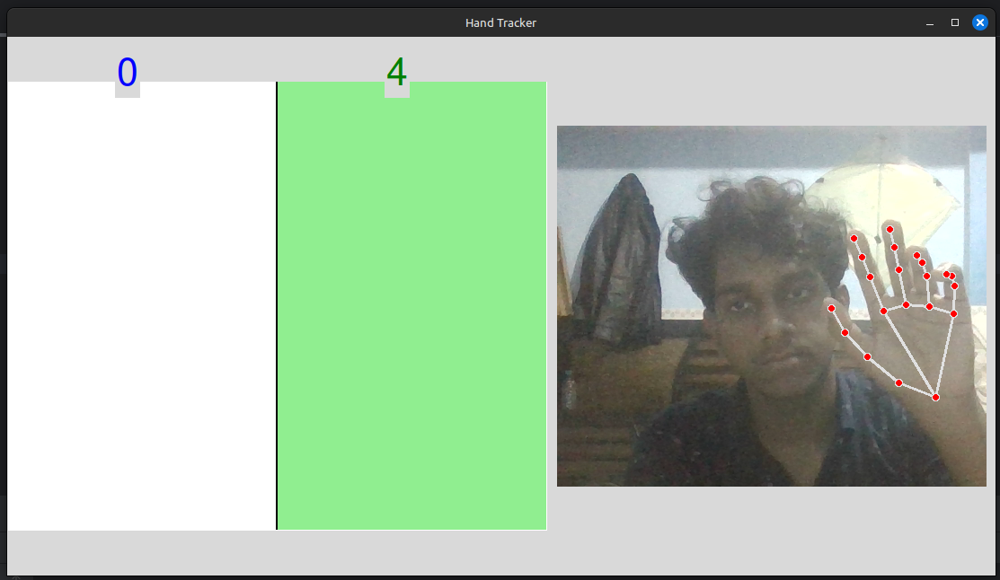
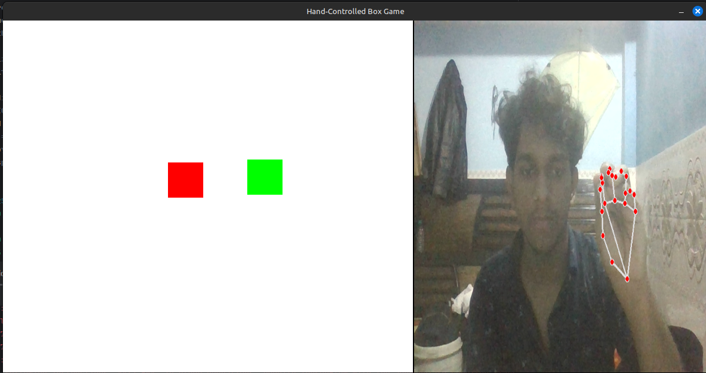

# Hand Tracking Projects  

This repository contains two Python projects using OpenCV, MediaPipe, Tkinter, and Pygame for hand tracking and interaction:  

1. **Hand Counter UI** – A Tkinter-based application that detects hand position and counts hand closures in different screen zones.  
2. **Hand-Controlled Box Game** – A Pygame-based interactive game where users can grab and move boxes using hand gestures.  

## 1️⃣ Hand Counter UI  

A Tkinter application that detects hand movement and counts the number of times a closed hand enters specific screen zones (left and right).  

### 🖼 Preview  
  

### 📌 Features  
- Uses MediaPipe for hand tracking  
- Highlights left and right screen zones  
- Counts the number of times a closed hand appears in a zone  
- Live camera feed displayed in the UI  

### ⚙️ Installation  
1. Install dependencies:  
   ```bash
   pip install opencv-python mediapipe pillow tkinter

# Hand-Controlled Box Game  

A Pygame-based interactive game where users can pick up and move boxes using hand gestures. This project uses MediaPipe for hand tracking and allows the user to control the movement of the boxes by making hand gestures.

## 🖼 Preview  


## 📌 Features  
- Real-time hand tracking using MediaPipe  
- Boxes change color when the hand hovers over them  
- Grabbing and moving boxes based on hand gestures  
- Camera feed displayed alongside the game  
- Customizable game layout and box properties  

## ⚙️ Installation  

### 1. Install the required dependencies:  
```bash
pip install opencv-python mediapipe pygame
